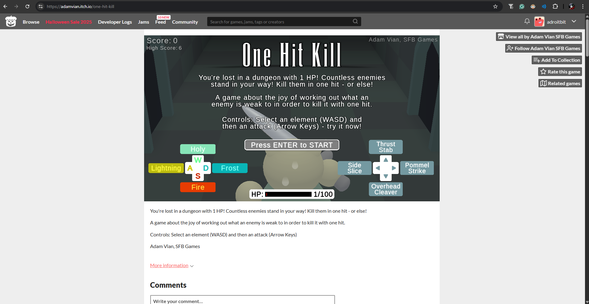
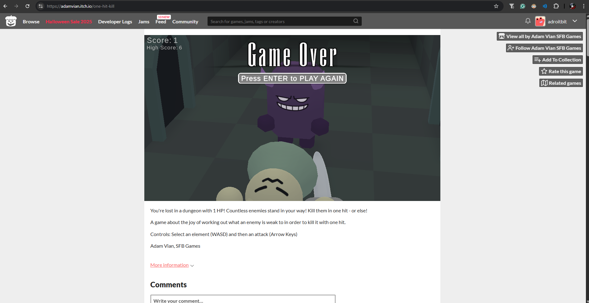

# OneHitKill-itchio-bot

## Introduction

One Hit Kill is a game itch.io website, where you have to fight off endless enemies while you health is at 1HP. Kill them in one hit

Each enemies have their own weakness.
- press (WASD) to choose element
- press Arrow keys to choose attack stance

This is a bot to automate that. And play the game instead of you.




You can try the game out yourself here: https://adamvian.itch.io/one-hit-kill


## Setup instructions to run this project locally

### step 1 - screen record (or data collection)

### step 2 - data labelling (folder-base labels)
```
dataset_{time_stamp}/
├── class1/
│   ├── image1.png
│   ├── image2.png
│   └── ...
├── class2/
│   ├── image1.png
│   └── ...
```
Manually **move** images from screenshots folder in "01 records" to dataset folder in "02 labelling"

### step 3 - train model

### step 4 - use model to run bot to play game for us